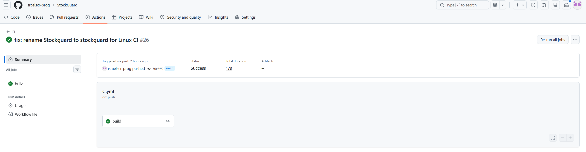

# StockGuard

## StockGuard es un sistema de gestión de existencias 

Sistema de gestión de existencias en Python 3.12+. Permite registrar productos con nombre, cantidad y precio, validando que los datos sean siempre coherentes: sin stock negativo, sin precios absurdos y con persistencia en JSON.
Descripción

StockGuard es un sistema de inventario de línea de comandos diseñado para ser auditado, documentado y protegido frente a entradas inválidas. El proyecto nació como código heredado con errores de lógica y ausencia de validaciones; ha sido refactorizado, testeado y equipado con un pipeline CI/CD.

Módulos principales:
Módulo	Responsabilidad
models.py , define la clase Item con validaciones de cantidad y precio
Storage.py , carga y guarda el inventario en inventory.json
Validator.py	Funciones de validación reutilizables (validar_cantidad, validar_precio)
stockguard.py	Punto de entrada heredado — lógica principal del sistema
Instalación

Requisitos: Python 3.12 o superior.

bash
# 1. Clona el repositorio
git clone https://github.com/israelscr-prog/StockGuard.git
cd StockGuard

# 2. Crea y activa el entorno virtual
python -m venv .venv

# Windows
.venv\Scripts\Activate.ps1

# Linux / macOS
source .venv/bin/activate

# 3. Instala las dependencias
pip install -r requirements.txt

# 4. Instala el paquete en modo editable
pip install -e .

Cómo ejecutar los tests

bash
# Ejecutar todos los tests con detalle
python -m pytest -v

# Ejecutar solo un módulo de tests
python -m pytest tests/test_models.py -v

# Ejecutar con cobertura (si tienes pytest-cov instalado)
python -m pytest --cov=stockguard -v

Suite de tests incluida:
Archivo	Qué prueba
tests/test_models.py	Creación válida de Item, rechazo de cantidad/precio negativos o cero
tests/test_storage.py	Carga de inventario inexistente, JSON corrupto y JSON válido; guardado con indent
tests/test_validator.py	Funciones validar_cantidad y validar_precio con casos límite
Cómo ejecutar el linter

bash
python -m flake8 . --exclude=.venv,venv,__pycache__,.git,stockguard.egg-info --max-line-length=88

Pipeline CI/CD

El repositorio incluye un workflow de GitHub Actions en .github/workflows/ci.yml que se ejecuta en cada push y pull_request a main.

Pasos del pipeline:

    Checkout del repositorio

    Setup de Python 3.12

    Instalación de dependencias (pip install -r requirements.txt && pip install -e .)

    Análisis estático con Flake8

    Ejecución de tests con pytest

Screenshot de Git Action que funciona correctamente

Vulnerabilidades corregidas

El código heredado carecía de validaciones de entrada. Se han aplicado las siguientes protecciones:

    Stock negativo: Item lanza ValueError si cantidad <= 0

    Precio absurdo: Item lanza ValueError si precio <= 0

    JSON corrupto: cargar_inventario() captura json.JSONDecodeError y retorna lista vacía en lugar de propagar la excepción

    Archivo inexistente: cargar_inventario() retorna [] si el fichero no existe

Uso de IA

Este proyecto ha sido desarrollado con asistencia de Perplexity AI como herramienta de auditoría, depuración y documentación.
Qué generó la IA

    Diagnóstico del error ModuleNotFoundError: No module named 'StockGuard' y pasos de resolución

    Alguna aportaion en generacion de codigos en archivos como:
    -models.py
    --test_models.py
    -Storage.py
    --test_storage.py
    -Validator.py
    --test_validator

    Identificación del conflicto de case-sensitivity entre Windows y Linux en Git (Stockguard vs stockguard)

    Generación del archivo pyproject.toml mínimo para hacer el paquete instalable con pip install -e .

    Versión corregida del ci.yml con pip install -e ., versiones actualizadas de actions y target correcto para Flake8

    Comandos git config core.ignorecase false + git mv para forzar el renombrado de la carpeta del paquete

    Este README

Qué modificó el desarrollador entre otras:

    Renombrado manual de las carpetas del paquete para mantener consistencia entre el sistema de ficheros y los imports

    Verificación y ajuste de los imports en los archivos de tests (from stockguard.models import Item)

    Revisión de cada solución propuesta antes de aplicarla, descartando las que no encajaban con la estructura real del proyecto

    Eliminación de tests/__init__.py tras verificar que causaba conflictos con el modo de importación de pytest

    Pruebas manuales locales en cada paso antes de hacer push al repositorio remoto

Reflexión

La IA actuó como un depurador experto que conoce las causas más comunes de cada tipo de error. Sin embargo, fue imprescindible la intervención humana para: (1) proporcionar el contexto exacto del entorno (estructura de carpetas, salidas de terminal), (2) decidir qué solución aplicar cuando había varias opciones, y (3) detectar que algunos comandos generados mezclaban el prompt del terminal con el comando real. El flujo más efectivo fue iterar: IA propone → desarrollador ejecuta y reporta → IA ajusta.
Estructura del proyecto

text

StockGuard/
├── .github/
│   └── workflows/
│       └── ci.yml          # Pipeline CI/CD
├── stockguard/             # Paquete principal
│   ├── __init__.py
│   ├── models.py           # Clase Item
│   ├── Storage.py          # Persistencia JSON
│   ├── Validator.py        # Validaciones de entrada
│   └── stockguard.py       # Lógica heredada
│   └── safe_stockguard.py  # Codigo Wrapper de la heredada
├── tests/
│   ├── test_models.py
│   ├── test_storage.py
│   └── test_validator.py
├── conftest.py             # Configuración pytest
├── pyproject.toml          # Build system
├── setup.cfg               # Configuración del proyecto y herramientas
├── requirements.txt
├── Audit.md
└── README.md

Licencia

Distribuido bajo licencia MIT. Consulta el archivo LICENSE para más detalles.

